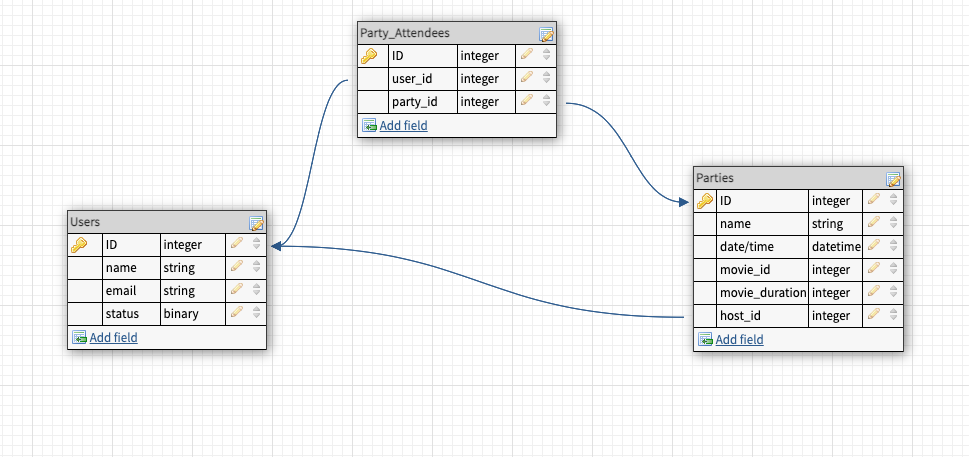

# Viewing Party Lite

## About this Project

Viewing Part Lite is an application in which users can explore movie options and create a viewing party event for themselves and other users of the application. It incorporates basic HTML views in the backend repo in addition to the base code.

This project consumes the [Movie DB API](https://www.themoviedb.org/documentation/api?language=en-US) to provide real-time data for each movie. This data includes reviews and rankings, as well as a list of the top 25 movies. Users can also search the database to find a movie and create a viewing party. The movie data is consumed via a facade and a service to abstract it out of the controller.

## Schema

In addition to the database tables, this project incorporates a movie poro.

## Setup for the use of the project
1. Install gem packages: `bundle install`
2. Setup the database: `rails db:create`

## Technologies

- Ruby 2.7.2
- Rails 5.2.6
- Faraday gem
- bcrypt gem

## Testing
This project is tested using RSpec, Capybara, VCR, Webmock, SimpleCov, and Shouldmatchers.

## Sample Views
**_Login Page_**\

**_New User Creation_**\

**_Discover Movies Page_**\

**_Top 25 Movies_**\

**_Movie Search Results_**\

**_Movie Show Page_**\

